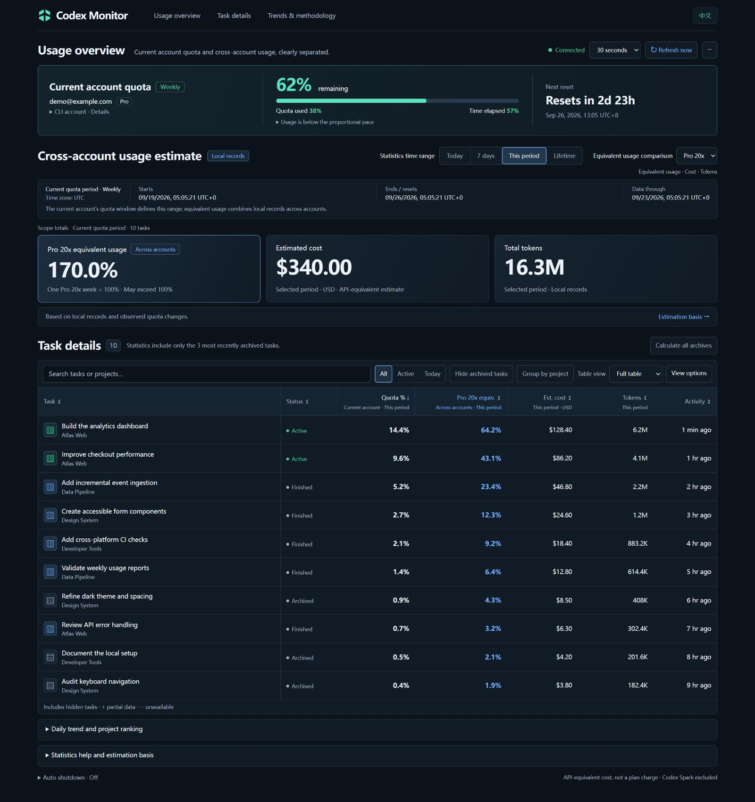
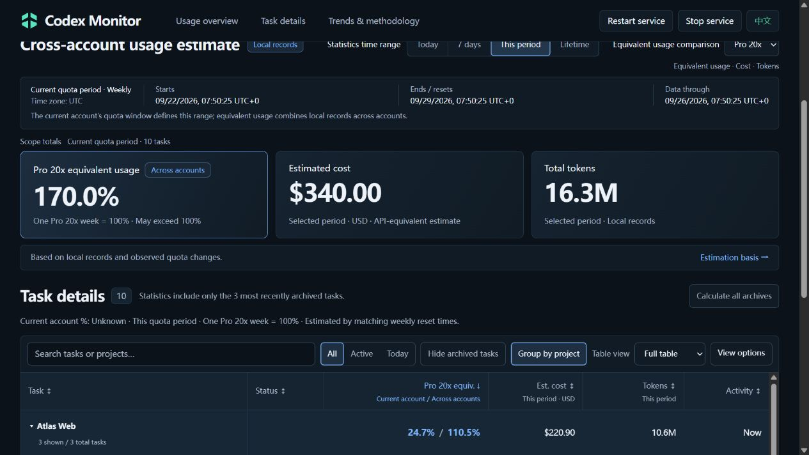
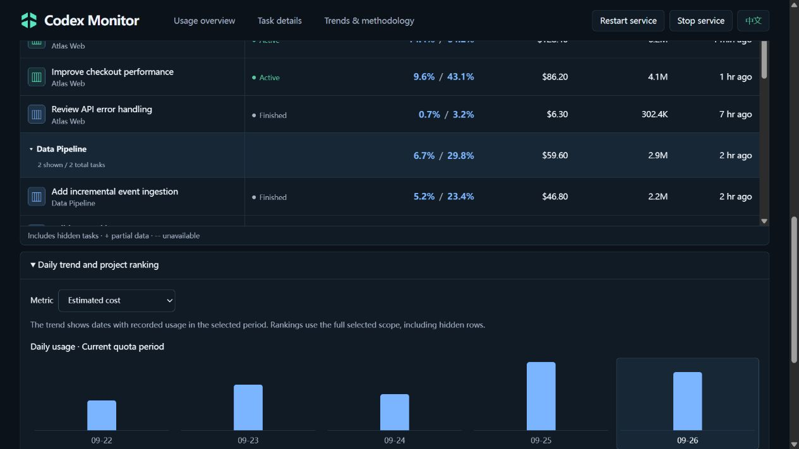

# Codex Monitor

This workstation now starts Monitor from a Codex `SessionStart` hook and stops its process tree when the desktop app exits. It uses no Windows startup entry, task or service. The hook needs a one-time trust review in Codex; opening the home screen alone does not trigger it, and minimizing to the tray is not an application exit.

Expand a task to view official lifetime quota usage and model, effort and speed breakdowns, including subtasks, with the query account and data cutoff. These totals are separate from current-period estimates. This uses the local Codex ChatGPT login and the desktop app's private query endpoint (which may change), plus a read-only thread index (Node.js 22.13+ recommended). It fetches only expanded tasks, caches for five minutes, and retains the same account's last good data on failure. `.cache/official-usage` contains no login credentials. It does not overwrite calibration parameters.

**See where your Codex usage goes — by task, project, and time range.**

[简体中文](README.md) | English

A local Codex usage dashboard with usability and reporting improvements built on [manuelsh/codex-monitor](https://github.com/manuelsh/codex-monitor).
This is an unofficial community project, not an OpenAI product or billing system.

**[v0.4.2](https://github.com/tabztggg/codex-monitor/releases/tag/v0.4.2)** · Fixes cpolar blank pages and reduces repeated requests during outages. See the [changelog](CHANGELOG.md).



Screenshots show the actual v0.4.0 interface with fictional accounts, tasks and usage.

<details>
<summary>More screenshots: project totals and daily trends</summary>





</details>

## Features

- **Task statistics:** recorded tokens, estimated costs, and one equivalent-usage column showing current account / across accounts. Project totals use the same pair; either value can be used for sorting.
- **Cross-account comparison:** express local usage as Pro 20x, Pro 5x or Plus weekly allowances; totals can exceed 100%.
- **Projects and trends:** optional project grouping with totals, daily trends and rankings; Today, Last 7 days, Current quota period or Task lifetime.
- **Archives:** read unarchived tasks and the 30 most recently archived root tasks, including attributable children. Choose **Calculate all archives** to read more.
- **Tables and languages:** search, filter, sort and choose columns. Switch Chinese/English; new visitors start in English and the choice is remembered.
- **Incremental refresh:** reuse unchanged logs; refresh every 30 seconds, 1, 2, 5 or 10 minutes. Outages retain existing data and retries gradually slow down.

## Quick start

Requires **Node.js >=20 (22+ recommended)**, npm and an authenticated Codex installation supporting `codex app-server`.

```bash
git clone https://github.com/tabztggg/codex-monitor.git
cd codex-monitor
npm ci
npm run build
```

Windows PowerShell:

```powershell
$env:CODEX_MONITOR_HOST = '127.0.0.1'
$env:CODEX_MONITOR_DRY_RUN = '1'
npm start
```

macOS / Linux:

```bash
CODEX_MONITOR_HOST=127.0.0.1 CODEX_MONITOR_DRY_RUN=1 npm start
```

Open **[http://127.0.0.1:4201](http://127.0.0.1:4201)**. Keep the terminal running; press `Ctrl+C` to stop.
These commands simulate shutdown actions without shutting down the computer. The dashboard needs no separate API key.
If Codex is not found, set `CODEX_MONITOR_CODEX_PATH` to its executable.

For console-free background operation, logon startup, desktop shortcuts and installed-copy updates, see [standalone Windows deployment](docs/standalone-windows.md).

## Understand the numbers

| Metric | Meaning |
| --- | --- |
| Account quota | Quota for Monitor's current Codex CLI account, which may differ from the desktop app account. |
| Plan equivalents · Current account | Replaces Quota %. The same calibration and display format as cross-account equivalents, limited to this quota period's records with matching weekly reset times. |
| Plan equivalent usage | Estimated usage from included local records across accounts; one selected plan's weekly allowance equals 100%. |
| Estimated cost / tokens | Recorded tokens and their API-equivalent USD value using a built-in price table, not a subscription bill. |

The equivalent estimator assumes recorded **Pro accounts are all 20x**; logs cannot reliably distinguish 5x from 20x.
Pro 20x, Pro 5x and Plus multiply both equivalent columns by 1, 4 and 20. The selector does not verify or change account tiers.
Current account % always covers the current quota period; project rows sum their tasks. Logs lack reliable account IDs, so reset-time matching (within 60 seconds) is only an estimate. Accounts with the same reset time cannot be distinguished. Missing matches or prices produce partial or unavailable values.
Missing logs, other-device usage and unpriced models affect accuracy.

`--` means unavailable or unattributed, not zero; `+` indicates partial data.
Initial calibration needs at least five percentage points of usable weekly-quota observations; existing values remain visible while calibration updates.
Hiding archives, searching or filtering changes displayed rows, not totals for the selected scope. See [metric details](docs/setup-and-reference.md#metric-details).

## Local data and remote access

The backend listens on loopback by default, reads Codex logs and metadata, and writes caches to `.cache/` without rewriting original sessions.
The local Codex app-server may still use the network to read account quota. Task details can contain private prompts, commands and paths.

**There is no built-in login or TLS; Origin checks are not authentication.** Remote access needs separate access controls.
For cpolar or a reverse proxy, explicitly configure `CODEX_MONITOR_ALLOWED_ORIGINS`; the Windows standalone copy uses `allowedOrigins` in `standalone.json`.
See [network access](docs/setup-and-reference.md#network-access) and [tunnel setup](docs/standalone-windows.md#reverse-proxy-or-tunnel).

## Documentation and development

[Full reference](docs/setup-and-reference.md) · [Windows deployment](docs/standalone-windows.md) · [Changelog](CHANGELOG.md)

Built with TypeScript, React, Vite, Express and WebSocket.
Develop with `npm run dev`; check with `npm test`, `npx tsc --noEmit` and `npm run build`.

## Credits and license

The original application was created by [manuelsh](https://github.com/manuelsh/codex-monitor); this version focuses on usability and usage analysis.
This repository currently has no `LICENSE` file and does not claim MIT/Apache licensing. Check applicable upstream permissions before use or redistribution.
