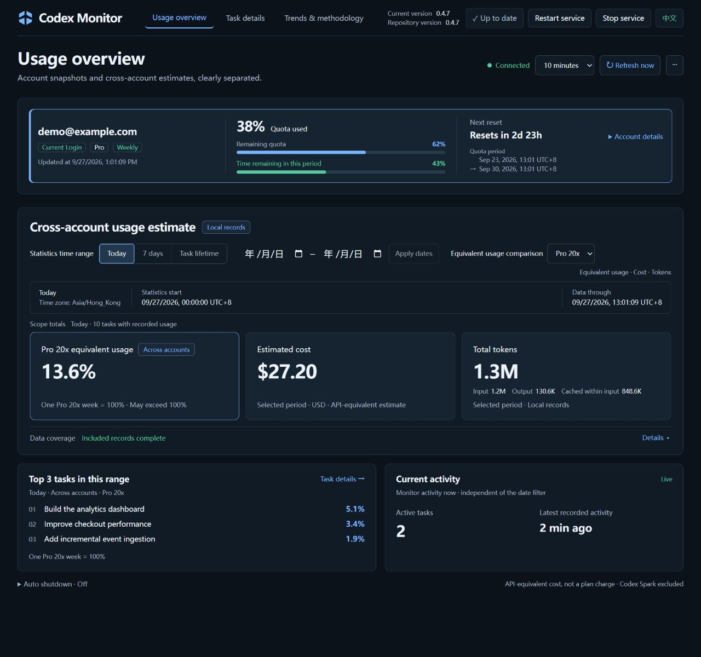
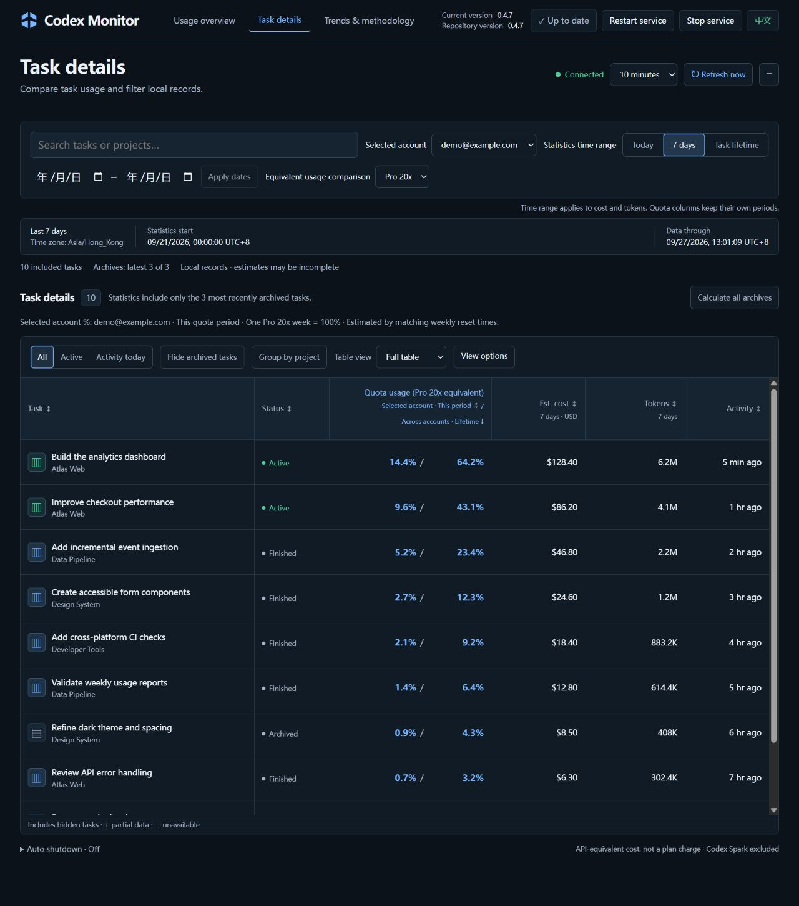
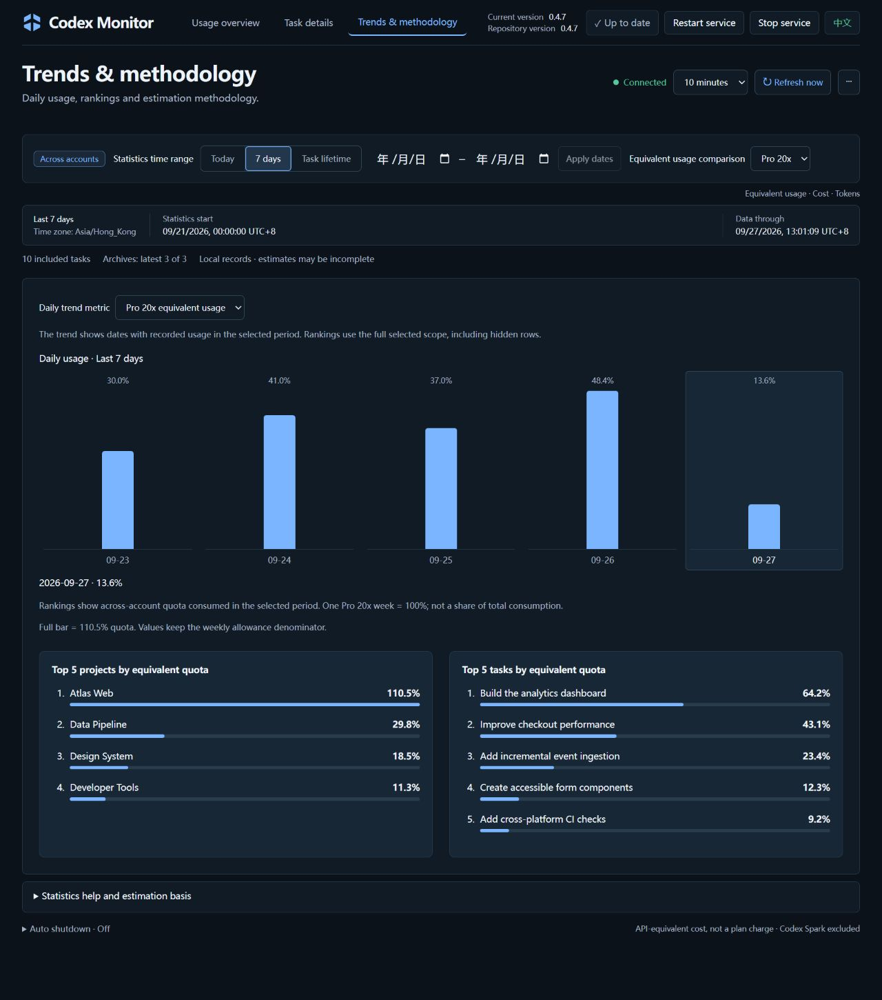

# Codex Monitor

**See where your Codex usage goes — by task, project, and time range.**

[简体中文](README.md) | English

A local Codex usage dashboard with usability and reporting improvements built on [manuelsh/codex-monitor](https://github.com/manuelsh/codex-monitor). An unofficial community project, not an OpenAI product or billing system.

**[v0.4.9](https://github.com/tabztggg/codex-monitor/releases/tag/v0.4.9)** · One-click install, update and uninstall entries in the repository root. [Changelog](CHANGELOG.md)



Screenshots of the actual v0.4.7 interface use fictional accounts, tasks and usage.

<details>
<summary>Task details and trends</summary>





</details>

## Three pages

- **Usage overview `/`:** the current login's quota, full quota period and update time, with paired bars comparing remaining quota and time; cross-account totals for the selected range, token breakdown, top 3 tasks and current activity.
- **Task details `/tasks`:** search, filters, sorting, column settings and project totals. Browse historical account records **without changing the Codex login**. Expand a task for official lifetime quota and model, effort and speed breakdowns.
- **Trends & methodology `/trends`:** daily cost/tokens, cross-account quota rankings for the selected range, data coverage and estimation details.

By default, read unarchived tasks and the 30 most recently archived root tasks, including attributable children. **Calculate all archives** expands that scope. Task statistics refresh every 10 minutes by default; choose 30 seconds or 1/2/5/10/30/60 minutes, or refresh manually. Older fast settings migrate to 10 minutes once; subsequent choices are remembered. Hidden pages pause new statistics requests and catch up when due on return; outages retain existing values. Account quota polls every 5 minutes and activity every minute, with 2-second activity checks while shutdown automation is armed. Chinese/English selection is remembered; new visitors start in English.

## Quick start

Requires **Node.js 22.13+ (recommended)**, npm and an authenticated Codex installation supporting `codex app-server`. Windows also requires **PowerShell 7**; launchers can use the Codex-bundled copy. Basic operation supports Node.js 20; official task details need a newer version capable of reading the thread index.

```bash
git clone https://github.com/tabztggg/codex-monitor.git
cd codex-monitor
```

**Windows:** the repository root provides four console-free entries:

| Entry | Purpose |
| --- | --- |
| **Install Codex Monitor.vbs** | Install/repair the local source version, create the desktop shortcut and logon startup, then open the dashboard. |
| **Codex Monitor.vbs** | Start Monitor; install automatically if missing. |
| **Update Codex Monitor.vbs** | Update the installed copy to the latest repository version. |
| **Uninstall Codex Monitor.vbs** | Stop and remove the application, startup task and owned shortcuts; keep configuration, usage caches, logs and backups. |

Installation handles npm dependencies and builds; Node.js, Codex and PowerShell 7 must already be available. Retained data stays in `%LOCALAPPDATA%\Programs\CodexMonitor` and is reused on reinstall. Uninstall leaves Codex, Node.js and the source checkout intact.

**One-click update:** double-click **Update Codex Monitor.vbs** in the root. It starts Monitor, updates the installed copy to this repository's latest `main`, and opens the dashboard for progress without a console window. A missing installation is deployed first; an update already in progress is reused. Your source checkout is preserved.

To redeploy your current local source instead:

```powershell
wscript.exe "Codex Monitor.vbs" deploy
```

Monitor runs independently of Codex. The header shows installed and repository versions with one status/action button: **Up to date** checks again, **Update to…** highlights an available update, and failed checks can be retried. Automatic checks are cached for 30 minutes; manual checks have a 5-minute minimum interval. Each repository request times out after 10 seconds. Updating installs this repository's latest `main` commit (requires Git, npm and PowerShell 7). Downloads and builds run while Monitor stays online; it then stops, replaces the runtime and restarts, preserving configuration and usage caches. Installation or health-check failures roll back. The adjacent buttons restart or stop Monitor; after stopping, use the desktop shortcut to start it again. [Windows deployment](docs/standalone-windows.md)

**macOS/Linux, or manual operation:**

```bash
npm ci
npm run build
CODEX_MONITOR_HOST=127.0.0.1 CODEX_MONITOR_DRY_RUN=1 npm start
```

For manual operation in PowerShell 7, set `$env:CODEX_MONITOR_HOST = '127.0.0.1'` and `$env:CODEX_MONITOR_DRY_RUN = '1'`, then run `npm start`.

Open **[http://127.0.0.1:4201](http://127.0.0.1:4201)**. Manual operation requires the terminal to stay open; `Ctrl+C` stops it. The manual commands above simulate shutdown without shutting down the computer. No separate API key is needed. If Codex is not found, set `CODEX_MONITOR_CODEX_PATH`.

## Metric scopes

| Display | Scope |
| --- | --- |
| Overview account quota | Monitor's current Codex CLI login, which may differ from the desktop app login. Saved snapshots are timestamped. |
| Left task quota value | **Selected account · This period**; historical accounts use their last recorded period. |
| Right task quota value | **Across accounts · Task lifetime**, including all retained periods and attributed subtasks. |
| Summary, cost, tokens, trends and rankings | **Cross-account records in the selected range:** Today, Last 7 days, Task lifetime or custom dates; Monitor time zone, inclusive end date. |

The time range does not change either task quota scope. Display filters such as search and hidden archives do not change range totals. Each side of the quota column has its own sort arrow; project rows sum their tasks.

**One selected plan's weekly allowance equals 100%; equivalents are not a share of total consumption and may exceed 100%.** Estimation assumes all recorded Pro accounts are 20x; logs cannot reliably identify 5x/20x. Pro 20x, Pro 5x and Plus apply comparison factors of 1, 4 and 20 without changing account tiers. The account badge shows only the plan returned by the API.

Account attribution matches weekly reset times within 60 seconds, not reliable account IDs; identical reset times cannot be distinguished. Cost is API-equivalent USD based on token prices, including priced GPT-6 Astra/Sol/Luna usage, not a subscription bill. Missing logs, other-device activity and unpriced models affect results. `--` means unavailable; `+` means partial data.

Calibration uses recent valid quota changes and retains the previous value while updating in the background. The page identifies automatic, retained or manual calibration. Official task details are queried separately, cached per account for five minutes and retain same-account data on failure. The private endpoint may change or lag and does not overwrite local calibration. [Full metric details](docs/setup-and-reference.md#metric-details)

## Local data and remote access

The backend listens on loopback by default, reads Codex logs and metadata, and caches in `.cache/` without rewriting original sessions. Official quota requests use the local Codex login and may access the network. Task details can contain prompts, commands and paths.

**There is no built-in login or TLS. Anyone who can access the page can read its data and, with a managed launcher, update, restart or stop Monitor.** Add your own access controls for public access; Origin checks are not authentication. cpolar/reverse proxies also require `CODEX_MONITOR_ALLOWED_ORIGINS`, or `allowedOrigins` in standalone Windows `standalone.json`. [Tunnel setup](docs/standalone-windows.md#reverse-proxy-or-tunnel)

## Documentation and development

[Full reference](docs/setup-and-reference.md) · [Windows deployment](docs/standalone-windows.md) · [Changelog](CHANGELOG.md)

Built with TypeScript, React, Vite, Express and WebSocket. Develop with `npm run dev`; check with `npm test`, `npx tsc --noEmit` and `npm run build`.

Standalone UI preview: `npx vite --config web/vite.preview.config.ts`, on port 4202 by default. Set `CODEX_MONITOR_PREVIEW_API` to select a backend; this does not replace the installed service.

## Credits and license

The original application was created by [manuelsh](https://github.com/manuelsh/codex-monitor); this version focuses on usability and usage analysis. This repository currently has no `LICENSE` file and does not claim MIT/Apache licensing. Check applicable upstream permissions before use or redistribution.
