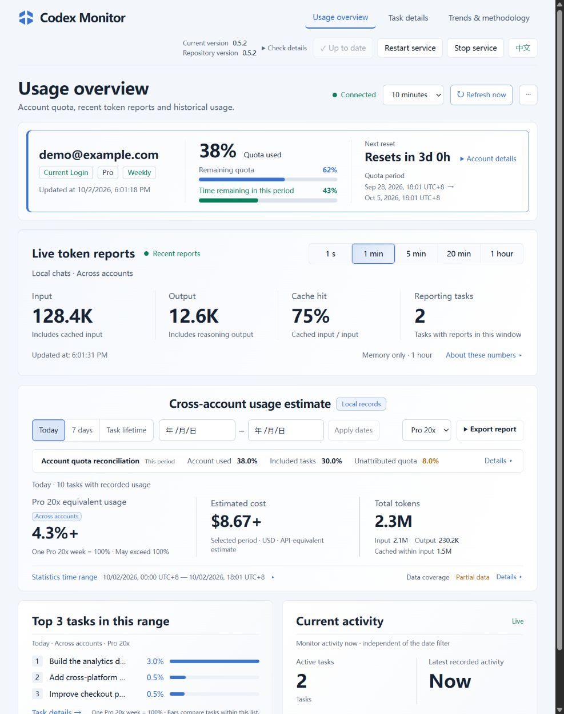
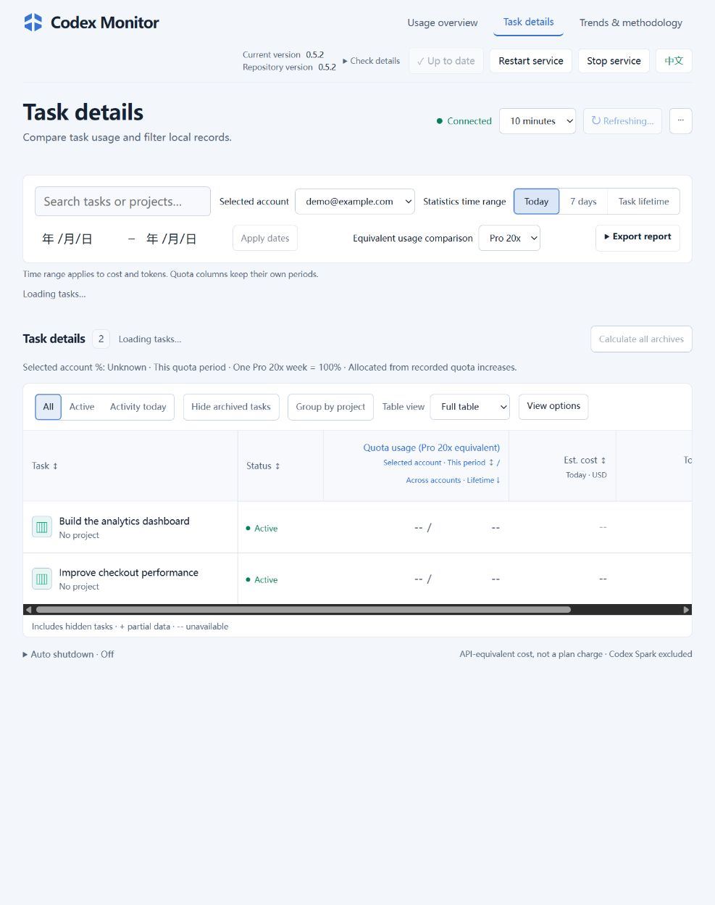
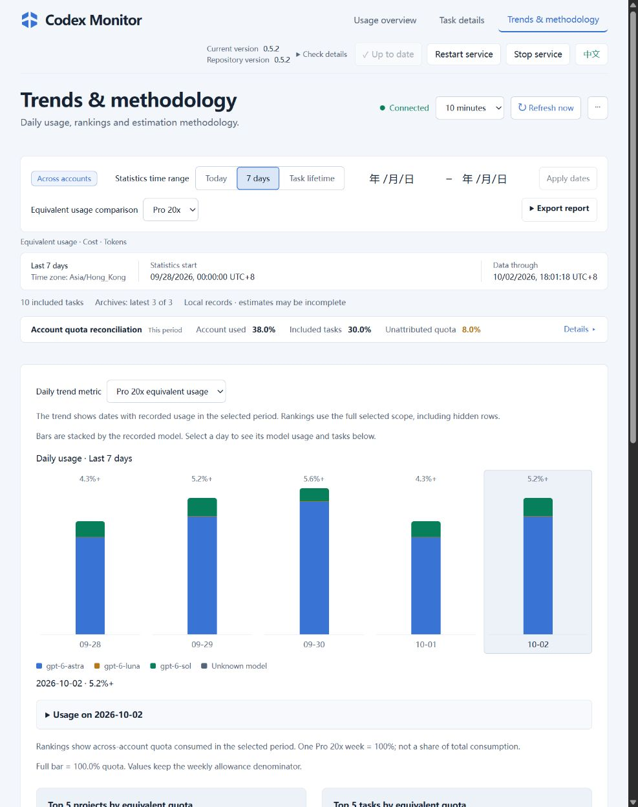

# Codex Monitor

English | [简体中文](README.zh-CN.md)

Codex Monitor runs locally and gives you a browser view of your remaining Codex quota, reset times, and task usage. You can check the tokens used by a conversation, group tasks by project, or pick a date range to see which tasks used the most.

This version builds on [manuelsh/codex-monitor](https://github.com/manuelsh/codex-monitor). I started working on it because I wanted to understand where my Codex quota was going. As I used the original, I added things I wanted day to day, including Chinese and English interfaces, project grouping, and usage estimates across accounts. Windows installation, background startup, and updates also have one-click launchers, so I can open the dashboard in a browser when I need it.

This is an unofficial project. Account quota comes from Codex; task quota equivalents and costs are estimates for comparing usage, not actual charges.

**[v0.5.2](https://github.com/tabztggg/codex-monitor/releases/tag/v0.5.2)** · Account quota reconciliation, calibration and archive fixes. [Changelog](CHANGELOG.md)

<picture>
  <source media="(prefers-color-scheme: dark)" srcset="assets/screenshots/v0.5.2-overview-en-dark.png">
  <source media="(prefers-color-scheme: light)" srcset="assets/screenshots/v0.5.2-overview-en.png">
  
</picture>

These screenshots show the v0.5.2 interface in light and dark themes, using fictional accounts, tasks and usage.

<details>
<summary>Task details and trends</summary>

<picture>
  <source media="(prefers-color-scheme: dark)" srcset="assets/screenshots/v0.5.2-tasks-en-dark.png">
  <source media="(prefers-color-scheme: light)" srcset="assets/screenshots/v0.5.2-tasks-en.png">
  
</picture>

<picture>
  <source media="(prefers-color-scheme: dark)" srcset="assets/screenshots/v0.5.2-trends-en-dark.png">
  <source media="(prefers-color-scheme: light)" srcset="assets/screenshots/v0.5.2-trends-en.png">
  
</picture>

</details>

## Three pages

The overview shows account quota, recent tokens, range totals, then rankings and activity. Expand the time-range and data-coverage details when needed.

- **Usage overview `/`:** the current login's quota, full quota period and update time, with paired bars comparing remaining quota and time; cross-account totals for the selected range, token breakdown, top 3 tasks and current activity.
- **Task details `/tasks`:** search, filters, sorting, column settings and project totals. Browse historical account records **without changing the Codex login**. Expand a task for official lifetime quota and model, effort and speed breakdowns.
- **Trends & methodology `/trends`:** cross-account model comparison, daily cost/tokens/cache hit, day-level task drilldown, range rankings and pricing details.

Five analysis features in v0.5.1:

| Feature | Where and how |
| --- | --- |
| Model comparison | Trends: sort models by input, output, total tokens, cache hit, task count or API-equivalent cost within the selected period. |
| Daily trends and task drilldown | Trends: bars stack usage by model. Select a day for its models and tasks; task links preserve that date. |
| Historical cache efficiency | Trends: total cached input divided by total input, including daily rates. Cached tokens are never counted twice. |
| Pricing basis | Below the model table: stored rates, sources, per-model check dates, pricing coverage, unpriced models and assumptions. |
| Report export | Statistics toolbar: download offline HTML, CSV or JSON on demand for the selected period/archive scope, including hidden and search-filtered tasks. |

Attribution follows recorded model switches; unknown models and incomplete data remain explicit. Costs are API-equivalent estimates, not subscription bills; official task-lifetime usage stays separate. Reports use task/project aliases by default, with optional display names. They omit account identity, paths, session IDs and conversation text, and create no periodic snapshots.

Live tokens offer **1-second / 1-minute / 5-minute / 20-minute / 1-hour** views of input, output, cache hit and reporting tasks. **The 1-second view divides the last minute's input/output by 60; it is not sampled every second.** Cache hit and task count still describe that minute. These cover local chats across accounts at report-receipt time, remain in memory for up to one hour and reset on restart. Visible pages read logs incrementally every 5 seconds and discover new chats every minute; account and full-history polling are unchanged.

By default, read unarchived tasks and the 30 most recently archived root tasks, including attributable children. **Calculate all archives** expands that scope. Task statistics refresh every 10 minutes by default; choose 30 seconds or 1/2/5/10/30/60 minutes, or refresh manually. Older fast settings migrate to 10 minutes once; subsequent choices are remembered. Hidden pages pause new statistics requests and catch up when due on return; outages retain existing values. Account quota polls every 5 minutes and activity every minute, with 2-second activity checks while shutdown automation is armed. Chinese/English selection is remembered; new visitors start in English.

Each quota refresh uses a short-lived Codex client to load the current login instead of retaining an old process identity. The existing minute activity scan checks local account changes without relying on file timestamps; keyring-only switches are picked up by the five-minute quota poll. Refresh now also refreshes the account, with a shared 30-second manual cooldown. Reads spanning an account switch are discarded, and old metadata-client notifications cannot overwrite the new quota.

Each history page has a 60-second deadline to allow an initial rebuild of large logs; timeouts retain previous results and allow retry. Unreadable logs are not treated as deleted tasks, and forks count only their new consumption. Missing token components or gaps in live cumulative reports are marked incomplete, not presented as complete zero usage.

## Quick start

**Installers:** Windows x64 EXE, macOS Intel/Apple Silicon PKG, and Linux x64/ARM64 DEB/portable packages include Node.js and Codex CLI; no separate Node, Git or npm installation is needed. [Releases](https://github.com/tabztggg/codex-monitor/releases) · [Installation, migration and removal](docs/installation-packages.md). Packages are unsigned and not notarized. Choose the matching platform and architecture, and verify files against `SHA256SUMS.txt`.

**Source installation (VBS launchers below):** Windows automatically prepares **Node.js/npm, Git, PowerShell 7 and Codex CLI**, reusing compatible installations first. Sign in to Codex yourself before using account features. Manual installation on other platforms requires Node.js 22.13+ (recommended), npm and Codex with `codex app-server` support; basic operation supports Node.js 20.

Without Git, [download the source ZIP](https://github.com/tabztggg/codex-monitor/archive/refs/heads/main.zip), extract it, and double-click **Install Codex Monitor.vbs**. With Git installed, clone instead:

```bash
git clone https://github.com/tabztggg/codex-monitor.git
cd codex-monitor
```

**Windows:** the repository root provides four console-free entries:

| Entry | Purpose |
| --- | --- |
| **Install Codex Monitor.vbs** | Install/repair the local source version, create the desktop shortcut and logon startup, then open the dashboard. |
| **Codex Monitor.vbs** | Start Monitor; install automatically if missing. |
| **Update Codex Monitor.vbs** | Update the installed copy to the latest repository version. |
| **Uninstall Codex Monitor.vbs** | Stop and remove the application, startup task and owned shortcuts; keep configuration, usage caches, logs and backups. |

Initial installation needs internet access. Missing tools go into `%LOCALAPPDATA%\Programs\CodexMonitorTools`: Node.js 24 LTS, official Git MinGit, PowerShell 7, and the official Codex npm package when needed. It then installs project dependencies and builds. No administrator access, system PATH changes or account sign-in changes are needed. ZIP downloads are SHA256-verified; failures stop without replacing existing tools. Logs: `.cache/desktop-entry.log` and `.cache/bootstrap.log` in the checkout. Uninstall preserves settings, usage data, private tools and the source checkout for reuse.

Install/repair stages the complete runtime before replacing the service, rolls back on failure and checks that the previous service recovers. Local installation and web updates exclude each other to prevent concurrent replacement. ZIP installations without a Git commit use stable version numbers to detect upgrades. Equal versions cannot prove identical commits; the root update entry can explicitly install the latest revision.

**One-click update:** double-click **Update Codex Monitor.vbs** in the root. It starts Monitor, updates the installed copy to this repository's latest `main`, and opens the dashboard for progress without a console window. A missing installation is deployed first; an update already in progress is reused. Your source checkout is preserved.

Installation errors show the dependency, URL, exception chain and script location in the dialog and `.cache/install-error.txt`. Socket error `10013` requires checking the failing machine's outbound rules, security logs and proxy; it does not mean a folder-write permission failure. [Download proxy and troubleshooting](docs/standalone-windows.md#download-network-troubleshooting)

To redeploy your current local source instead:

```powershell
wscript.exe "Codex Monitor.vbs" deploy
```

Monitor runs independently of Codex. The header shows installed and repository versions with one status/action button: **Up to date** checks again, **Update to…** highlights an available update, and failed checks can be retried. Checks run every 30 minutes, or after 5 minutes following a failure; GitHub rate limits honor the server retry time. Hidden pages pause checks. Manual checks have a 5-minute minimum interval and each request still times out after 10 seconds. Verified versions are reused for unchanged commits. Failed checks retain the last confirmed result; Check details shows the reason, confirmation time and next retry time, with retries disabled during cooldown. Updating installs this repository's latest `main` commit (requires Git, npm and PowerShell 7). Downloads and builds run while Monitor stays online; it then stops, replaces the runtime and restarts, preserving configuration and usage caches. Installation or health-check failures roll back. The adjacent buttons restart or stop Monitor; after stopping, use the desktop shortcut to start it again. [Windows deployment](docs/standalone-windows.md)

**macOS/Linux, or manual operation:**

```bash
npm ci
npm run build
CODEX_MONITOR_HOST=127.0.0.1 CODEX_MONITOR_DRY_RUN=1 npm start
```

For manual operation in PowerShell 7, set `$env:CODEX_MONITOR_HOST = '127.0.0.1'` and `$env:CODEX_MONITOR_DRY_RUN = '1'`, then run `npm start`.

Open **[http://127.0.0.1:4201](http://127.0.0.1:4201)**. Manual operation requires the terminal to stay open; `Ctrl+C` stops it. The manual commands above simulate shutdown without shutting down the computer. No separate API key is needed. If Codex is not found, set `CODEX_MONITOR_CODEX_PATH`.

## Metric scopes

| Display | Scope |
| --- | --- |
| Overview account quota | Monitor's current Codex CLI login, which may differ from the desktop app login. Saved snapshots are timestamped. |
| Left task quota value | **Selected account · This period**; historical accounts use their last recorded period. |
| Right task quota value | **Across accounts · Task lifetime**, including all retained periods and attributed subtasks. |
| Summary, cost, tokens, trends and rankings | **Cross-account records in the selected range:** Today, Last 7 days, Task lifetime or custom dates; Monitor time zone, inclusive end date. |

The time range does not change either task quota scope. Display filters such as search and hidden archives do not change range totals. Each side of the quota column has its own sort arrow; project rows sum their tasks.

**One selected plan's weekly allowance equals 100%; equivalents are not a share of total consumption and may exceed 100%.** Estimation assumes all recorded Pro accounts are 20x; logs cannot reliably identify 5x/20x. Pro 20x, Pro 5x and Plus apply comparison factors of 1, 4 and 20 without changing account tiers. The account badge shows only the plan returned by the API.

Account attribution matches weekly reset times within 60 seconds, not reliable account IDs; identical reset times cannot be distinguished. Cost is API-equivalent USD based on token prices, including priced GPT-6 Astra/Sol/Luna and GPT-6.1 Sol usage, not a subscription bill. Pricing updates recalculate existing cached statistics. Missing logs, other-device activity and unpriced models affect results. `--` means unavailable; `+` means partial data.

Selected-account quota is allocated from recorded increases using response cost weights, independently of cross-account equivalents. **Account quota reconciliation** shows included tasks, tasks outside the current scope and unattributed quota; together they match the account total. Missing account windows, prices or continuous observations remain unassigned.

Automatic cross-account calibration requires at least five quota percentage points and 90% coverage of both quota increases and matching priced costs in that account window. Otherwise the prior reference remains. Manual overrides apply only to their matching account and period. Official task details are queried separately, cached per account for five minutes and retain same-account data on failure. The private endpoint may change or lag and does not overwrite local calibration. [Full metric details](docs/setup-and-reference.md#metric-details)

## Local data and remote access

The backend listens on loopback by default, reads Codex logs and metadata, and caches in `.cache/` without rewriting original sessions. Official quota requests use the local Codex login and may access the network. Task details can contain prompts, commands and paths.

**There is no built-in login or TLS. Anyone who can access the page can read its data and, with a managed launcher, update, restart or stop Monitor.** Add your own access controls for public access; Origin checks are not authentication. cpolar/reverse proxies also require `CODEX_MONITOR_ALLOWED_ORIGINS`, or `allowedOrigins` in standalone Windows `standalone.json`. [Tunnel setup](docs/standalone-windows.md#reverse-proxy-or-tunnel)

## Documentation and development

[Full reference](docs/setup-and-reference.md) · [Windows deployment](docs/standalone-windows.md) · [Changelog](CHANGELOG.md)

Built with TypeScript, React, Vite, Express and WebSocket. Develop with `npm run dev`; check with `npm test`, `npx tsc --noEmit` and `npm run build`.

Standalone UI preview: `npx vite --config web/vite.preview.config.ts`, on port 4202 by default. Set `CODEX_MONITOR_PREVIEW_API` to select a backend; this does not replace the installed service.

## Credits and license

The original application was created by [manuelsh](https://github.com/manuelsh/codex-monitor); this version focuses on usability and usage analysis. This repository currently has no `LICENSE` file and does not claim MIT/Apache licensing. Check applicable upstream permissions before use or redistribution.
