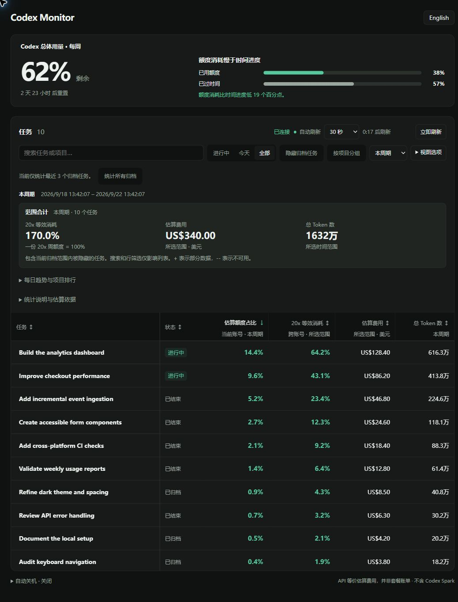
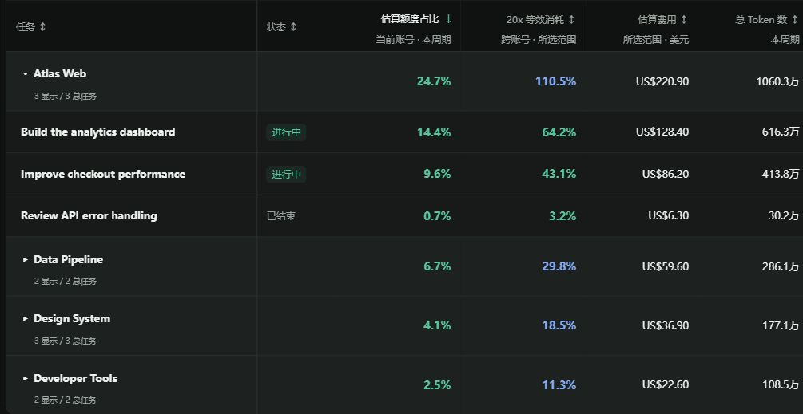
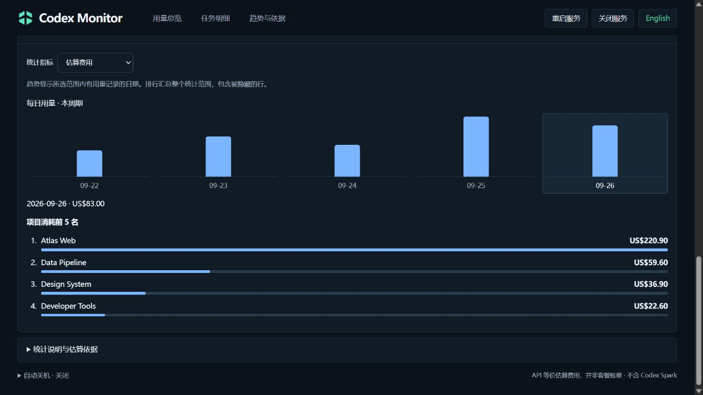

# Codex Monitor

**看清 Codex 用量花在哪里：按任务、项目和时间范围分析。**

简体中文 | [English](README.en.md)

**最新版本：[v0.3.0](https://github.com/tabztggg/codex-monitor/releases/tag/v0.3.0)** ·
持久校准、账号数据保留与表格交互改进 · [更新日志与升级说明](CHANGELOG.md)

一个在本地运行的 Codex 用量仪表盘，集中查看账号额度、Token、估算费用和任务活动。
本版本基于 [manuelsh/codex-monitor](https://github.com/manuelsh/codex-monitor)
扩展，增加中英文界面、归档统计、项目汇总和用量分析功能。
这是非官方社区项目，不是 OpenAI 官方产品或计费系统。

## 界面预览

以下为 v0.2.0 真实应用界面的示例截图，项目名和用量均为虚构，不包含私人账号或对话数据。
截图通过「视图选项」隐藏了活动时间列；v0.3.0 更新了排版并加入下述控件。

### 用量一目了然

集中查看账号额度、任务统计、跨账号 20x 等效消耗、估算费用和 Token 数量。



### 按项目汇总

开启项目分组后，每组直接显示额度占比、20x 等效消耗、费用和 Token 合计。
展开查看任务明细，折叠后仍保留项目总数值。



### 每日趋势与项目排行

展开分析面板，查看每日用量变化和项目消耗排行；支持切换费用、Token 和 20x 指标。



## 功能概览

| 功能 | 说明 |
| --- | --- |
| 账号额度概览 | 查看账号身份、剩余额度、重置倒计时及消耗进度；读取失败时保留并标注旧快照。不计入 Spark。 |
| 任务用量 | 对比任务的 Token、API 等价费用和当前账号估算额度占比。 |
| 套餐等效消耗 | 支持 Pro 20x、Pro 5x、Plus 对比，可超过 100%；有效校准跨周期和重启保留。 |
| 项目汇总 | 按 Codex 保存的项目分组，汇总额度占比、20x、费用和 Token；默认不分组。 |
| 归档统计 | 默认实际读取最近 30 个归档主任务，以及未归档任务；点击按钮才统计所有归档。 |
| 时间范围 | 当前支持今天、近 7 天、本周期、任务累计。 |
| 趋势与排行 | 查看每日用量、项目消耗前五名，可切换费用、Token 和 20x 指标。 |
| 表格设置 | 明确选择完整表格／精简视图；完整视图可隐藏列，精简视图可选择指标。支持搜索、筛选、排序、密度和固定表头。 |
| 自动刷新 | 支持 30 秒、1 / 2 / 5 / 10 分钟的增量刷新及立即刷新，需要时可手动重新统计当前范围。 |
| 中英文切换 | 右上角切换界面语言，新访问者默认英语，记住上次选择。 |
| 任务详情 | 查看预览、路径和 Token 明细，跳转 Codex；已跟踪的运行可查看实时内容。 |

语言、刷新间隔、对比套餐、表格视图、精简指标、列显隐和显示密度保存在当前浏览器。刷新页面后，分组恢复关闭，
归档范围恢复最近 30 个。任务名、项目名和用户原文保持原样，不做自动翻译。

## 快速开始

需要 Node.js、npm，以及已登录、支持 `codex app-server` 的 Codex 安装。
本版本已在 Windows + Node.js 24 环境实测；仓库的 CI 配置使用 Node.js 22。
具体要求和平台限制见[使用文档](docs/setup-and-reference.md#requirements)。

下载或克隆仓库后，在项目根目录执行：

```bash
npm ci
npm run build
```

Windows PowerShell 启动：

```powershell
$env:CODEX_MONITOR_HOST = '127.0.0.1'
$env:CODEX_MONITOR_DRY_RUN = '1'
npm start
```

macOS / Linux 启动：

```bash
CODEX_MONITOR_HOST=127.0.0.1 CODEX_MONITOR_DRY_RUN=1 npm start
```

打开 **[http://127.0.0.1:4201](http://127.0.0.1:4201)**，保持终端运行。
按 `Ctrl+C` 停止前台服务。以上命令明确启用关机模拟模式，不执行真实关机。

找不到 Codex 时，通过 `CODEX_MONITOR_CODEX_PATH` 指定其可执行文件路径。
仪表盘不要求单独提供 API Key，实时账号信息通过本机已登录的 Codex 获取。

Windows `.cmd` 启动器同样默认监听本机，支持后台启动。
已配置当前用户独立安装时，启动器会转到对应计划任务，关闭 Codex 不会停止 Monitor。
登录自启、启停管理、日志和重新部署更新见 [Windows 独立安装说明](docs/standalone-windows.md#中文说明)；
仓库目前没有通用的一键安装脚本。
局域网地址可放在本地配置中，无须提交到仓库。
详见 [Windows 启动说明](docs/setup-and-reference.md#windows-launchers)。

## 统计指标怎么理解

| 指标 | 含义 | 范围 |
| --- | --- | --- |
| 账号总体额度 | Codex 返回的当前登录账号额度。 | 整个账号，不受任务筛选或归档数量限制。 |
| 估算额度占比 | 按任务记录的费用权重，分配实际观测到的账号额度增量。 | 仅当前账号、本周期；其他时间范围显示 `--`。 |
| 套餐等效消耗 | 所选范围的估算费用，除以每 1% 20x 周额度校准费用，再按选定套餐的标称比例折算。 | 包含所选本地记录中的历史账号用量，不限当前登录账号。 |
| 估算费用 | 使用内置模型价格表，将 Token 折算为 API 等价美元。 | 所选范围；不是订阅账单或实际扣费。 |
| 总 Token 数 | 任务记录的 Token，包含可归属的子任务。 | 所选时间范围。 |

**一份所选套餐的周额度作为 100% 参考值。** Pro 20x、Pro 5x、Plus
分别将原 20x 校准结果乘以 1、4、20。250% 表示所选范围的估算消耗相当于 2.5 份所选套餐周额度，
不表示当前账号自己的额度已经使用了 250%。

当前估算器按“记录中的 Pro 账号均为 20x”处理。日志只标识 Pro，不能可靠区分
5x / 20x；对比选择器只改变参考套餐，不修改记录中的账号档位，也不会自动核验档位。混用不同档位、缺失日志、其他设备
上的使用、未定价模型和工具费用都会影响准确性。程序不会登录历史账号，也不会
补取本机未记录的历史用量。

- `--`：暂不可用、尚未分配或缺少依据，不代表消耗为零。
- `+`：部分数据或不完整估算。
- 价格来自代码内置表，不会自动同步最新官方价格。
- 20x 校准至少需要 5 个百分点的可用周额度变化记录，刚安装时可能显示 `--`。

有效校准会保存到本地，在新样本累积期间继续显示。已读取的校准样本独立于归档
展示范围保留 30 天，缩小表格范围不会丢弃它们；切换到周起点更早的账号也能更新。
保存失败会在后续刷新重试。升级保留旧校准文件；缺少参考值时从已加载的历史记录恢复。

顶部总体用量显示 Monitor 自己的 Codex CLI 账号，可能与桌面应用不同。接口暂时失败时，
保留上次确认的账号数据和更新时间，并明确标注旧快照；旧额度不用于新的用量分摊。
确认退出或切换到其他账号后，不继承旧账号额度。首次启动时额度窗口就绪后立即刷新任务数据。

从旧版日志解析器升级时，会重建归档统计缓存和额度分配基线。此前已经消耗的
账号额度保留为“未归因”，不继续沿用可能错误的任务占比；之后新观测到的额度
增量再分配给任务。Token、估算费用和 20x 等效消耗会从原始日志重新计算。

详细计算方式见[统计口径说明](docs/setup-and-reference.md#metric-details)。

## 仪表盘操作

统计设置和范围合计在任务筛选与表格上方，趋势和详细说明位于下方。所有窗口宽度
默认使用完整表格，宽度不足时左右滚动。选择精简视图后显示任务、所选指标和状态，
展开任务可查看其他指标；只有完整表格提供列显隐设置。视图与精简指标会被记住。
“更多操作”包含刷新间隔和重新统计。零额度弱化显示，时间进度偏差在五个百分点
以内采用中性提示。

## 时间范围与归档范围

默认查看本周期。“今天”和“近 7 天”按**监控电脑的时区**计算自然日，
近 7 天包含今天和此前六天；“任务累计”读取所选任务的可用历史。
统计时区显示在估算依据面板中。

费用、Token、20x、项目汇总、每日趋势和排行跟随所选范围。
切换期间保留旧结果和原有范围标签。趋势只绘制有用量记录的日期，
不会把没有记录的日期伪装成已确认的零消耗。

默认范围是全部未归档主任务和最近 **30 个归档主任务**，以及可归属的子任务。
程序先选定归档范围再解析日志，不会先统计全部再只显示 30 个。
点击“统计所有归档”才扩大读取范围，历史较多时可能耗时较长。

日志中继承的父任务信息不会覆盖当前任务身份。多层子任务用量只向所属主任务
汇总一次，不会把主任务隐藏。日志暂时读取失败后，下次刷新会重新尝试。

启动时加载一次当前归档范围，默认是最近 30 个归档主任务及全部未归档任务。
之后自动刷新和“立即刷新”复用没有变化的日志，日志增长时只处理新增内容。
任务结束后读取最后新增的日志，再复用未变化的结果；恢复活动后继续增量更新。
账号额度和任务活动状态仍按各自的周期更新。

“重新统计”会明确重新读取当前归档范围内的日志，不会把最近 30 个扩大成全部归档，
也不会重置已保存的额度分配。切换时间范围、搜索、排序或显示筛选不会隐式全量重算。
任务元数据缓存最长 60 秒，并发请求共享同一次读取，避免每页重复拉取任务列表。

“隐藏归档任务”、搜索、状态筛选和折叠分组只影响列表显示。
范围合计、项目合计和排行仍包含所选归档范围内被隐藏的任务。
选择“任务累计”不会自动触发全量归档读取。

## 本地数据与访问方式

服务端默认只监听本机，读取本地 Codex 日志和元数据，将自己的缓存写入 `.cache/`，
不改写 Codex 原始会话日志。仪表盘没有向分析服务上传历史的逻辑；
它调用的本机 Codex app-server 仍可能通过 Codex 客户端访问网络。

任务详情可能包含提示词、路径、命令和私人内容。服务**没有内置登录认证或 TLS**，
Origin 检查不等于身份认证，不能据此认定公网隧道安全。
如需局域网或远程访问，应另行限制权限，见[网络说明](docs/setup-and-reference.md#network-access)。

项目保留上游的可选自动关机功能。本文启动命令和当前 Windows 启动器都使用
模拟模式；真实关机基于 Windows `shutdown.exe`，不提供 macOS / Linux 原生关机实现。
取消操作会等待尚未完成的调度命令；如果 Windows 拒绝取消，界面会保留待关机
状态并显示错误。

## 开发

```bash
npm run dev
npm test
npx tsc --noEmit
npm run build
```

开发后端使用 4201 端口，Vite 页面通常使用 5173。启动开发服务前，
先停止占用同一后端端口的监控实例。

技术栈：TypeScript、React、Vite、Express、WebSocket。
配置、启动器、排错和源码结构见[完整使用文档](docs/setup-and-reference.md)。

`tsup` 的依赖覆盖将 esbuild 更新到 0.28.2 或更高版本，以修复
[GHSA-g7r4-m6w7-qqqr](https://github.com/evanw/esbuild/security/advisories/GHSA-g7r4-m6w7-qqqr)。
在 tsup 自身的依赖范围包含修复版本之前，应保留此配置。

## 致谢与许可证状态

基于 [manuelsh/codex-monitor](https://github.com/manuelsh/codex-monitor) 开发，
保留上游原作者署名。本版本主要扩展用量分析、归档统计、项目汇总和界面交互。

当前工作副本没有项目 `LICENSE` 文件。本说明不替上游代码指定许可证，
也不宣称采用 MIT / Apache 协议。发布可再分发版本前，需要确认并保留适用的
上游许可和版权声明。
