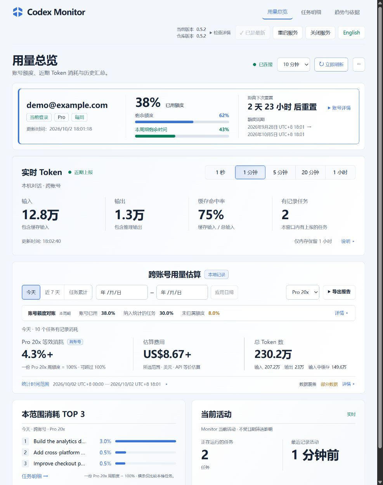
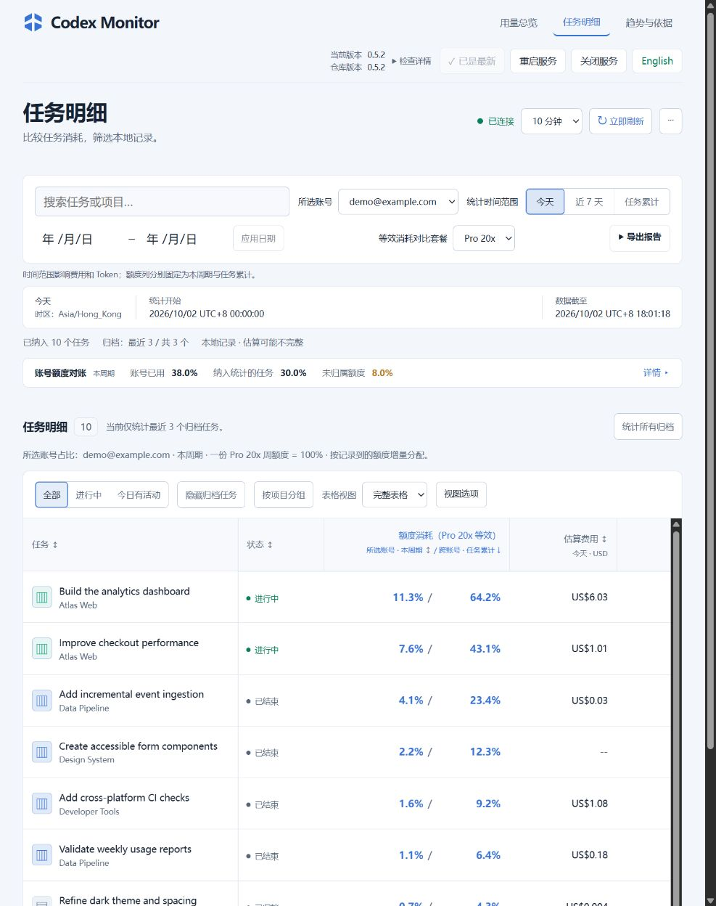
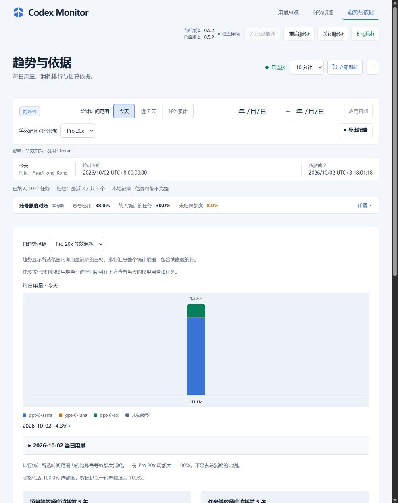

# Codex Monitor

简体中文 | [English](README.en.md)

Codex Monitor 是一个在本机运行的网页工具，用来查看 Codex 还剩多少额度、什么时候重置，以及用量主要花在哪些任务上。你可以看单个聊天用了多少 Token，也可以按项目汇总，选一段时间看看哪些任务消耗最多。

这个项目的原版来自 [manuelsh/codex-monitor](https://github.com/manuelsh/codex-monitor)。我最初只是想弄清楚自己的额度花在哪儿，后来就在原版上按自己的使用习惯继续改，补了中英文切换、项目分组和跨账号用量估算。Windows 的安装、后台启动和更新也做成了一键入口，平时打开网页就能用。

这是个非官方工具。账号额度来自 Codex，任务的等效消耗和费用是估算值，用来比较用量，不代表实际账单。

**[v0.5.2](https://github.com/tabztggg/codex-monitor/releases/tag/v0.5.2)** · 账号额度对账、校准与归档统计修复。[更新日志](CHANGELOG.md)

<picture>
  <source media="(prefers-color-scheme: dark)" srcset="assets/screenshots/v0.5.2-overview-zh-dark.png">
  <source media="(prefers-color-scheme: light)" srcset="assets/screenshots/v0.5.2-overview-zh.png">
  
</picture>

v0.5.2 网页截图，随深浅色主题切换；账号、任务和用量均为虚构演示数据。

<details>
<summary>任务明细与趋势页面</summary>

<picture>
  <source media="(prefers-color-scheme: dark)" srcset="assets/screenshots/v0.5.2-tasks-zh-dark.png">
  <source media="(prefers-color-scheme: light)" srcset="assets/screenshots/v0.5.2-tasks-zh.png">
  
</picture>

<picture>
  <source media="(prefers-color-scheme: dark)" srcset="assets/screenshots/v0.5.2-trends-zh-dark.png">
  <source media="(prefers-color-scheme: light)" srcset="assets/screenshots/v0.5.2-trends-zh.png">
  
</picture>

</details>

## 三个页面

首页依次展示账号额度、实时 Token、范围汇总与排行／活动；统计时间详情和数据覆盖可展开查看。

- **用量总览 `/`**：当前登录账号的额度、完整周期和更新时间，双进度条对比剩余额度与剩余时间；所选范围的跨账号估算、费用、Token 拆分、消耗前 3 名与当前活动。
- **任务明细 `/tasks`**：搜索、筛选、排序、列设置和项目合计。可查看历史账号记录，**不会切换 Codex 登录**。展开任务可查询官方累计额度及模型、推理强度、速度分布。
- **趋势与依据 `/trends`**：跨账号模型对比、每日费用／Token／缓存命中率、当天任务下钻、范围排行与价格依据。

v0.5.1 的 5 项分析功能：

| 功能 | 入口与用途 |
| --- | --- |
| 模型对比 | 趋势页：按所选范围比较输入、输出、总 Token、缓存命中率、任务数和 API 等价费用，可排序。 |
| 日趋势与任务下钻 | 趋势页：柱形按模型堆叠；点击日期查看当天模型和任务，打开任务时保留日期。 |
| 历史缓存效率 | 趋势页：总缓存输入 ÷ 总输入，支持每日查看；缓存不重复计入总 Token。 |
| 价格依据 | 模型表下方：单价、来源、逐模型核对日期、定价覆盖率、未定价模型及计价假设。 |
| 报告导出 | 统计栏：按需下载离线 HTML／CSV／JSON，覆盖所选日期和归档范围，不受搜索或隐藏行影响。 |

模型归属跟随日志中的实际切换，未知模型和缺失数据明确标记。费用是 API 等价估算，不是套餐账单；任务的官方累计用量仍独立显示。导出默认用任务／项目别名，可选显示名称；不导出账号身份、路径、会话 ID 或聊天原文，也不定期保存快照。

首页实时 Token 可切换 **1 秒／1 分钟／5 分钟／20 分钟／1 小时**，显示输入、输出、缓存命中率和任务数。**“1 秒”是最近 1 分钟输入／输出除以 60 的均值**，不是逐秒采样；命中率和任务数仍按该分钟统计。数据覆盖本机跨账号聊天，按收到记录的时间计入，内存最多保留 1 小时，重启重新累计。可见时每 5 秒增量读取日志，每分钟发现新聊天；账号和全量历史查询频率不变。

默认读取未归档任务和最近 30 个归档主任务，包含可归属的子任务；选择“统计所有归档”才扩大读取。任务统计默认每 10 分钟刷新，可选 30 秒、1／2／5／10／30／60 分钟，也可立即刷新。旧版高频设置首次升级为 10 分钟，之后记住你的选择。页面隐藏时暂停新的统计请求，返回后按需补刷，断线保留旧值。账号额度每 5 分钟更新、活动检测每 1 分钟；启用自动关机时活动检测恢复为 2 秒。中英文可切换并记住选择，新访问者默认英语。

账号额度每次通过独立的短时 Codex 查询读取当前登录状态，避免常驻进程一直保留旧账号。每分钟复用活动扫描检查本地账号身份变化（不依赖文件修改时间），切换后提前刷新；仅保存在系统凭据库的切换随 5 分钟额度轮询更新。点击“立即刷新”也会刷新账号，普通手动读取共享 30 秒间隔。读取中再次切换账号会丢弃未确认结果，旧进程通知不会覆盖新账号额度。

历史查询单页等待上限为 60 秒，为首次重建较大日志预留时间；超时保留旧结果并允许重试。日志暂时不可读不会当成任务删除；分叉聊天只计算自身新增消耗。缺少 Token 分项或实时累计有缺口时标记不完整，不用零值冒充完整统计。

## 快速开始

**安装包：** Windows x64 EXE、macOS Intel／Apple Silicon PKG、Linux x64／ARM64 DEB 与便携包，内置 Node.js 和 Codex CLI，无需另装 Node、Git 或 npm。[下载 Releases](https://github.com/tabztggg/codex-monitor/releases) · [安装、迁移与卸载说明](docs/installation-packages.md)。安装包未签名、未做 Apple 公证；请按系统和架构下载，并用 `SHA256SUMS.txt` 核对文件。

**源码安装（以下 VBS 入口）：** Windows 会检查并自动准备 **Node.js/npm、Git、PowerShell 7 和 Codex CLI**，优先复用已有可用版本。使用前需自行登录 Codex。其他平台手动安装需要 Node.js 22.13+（推荐）、npm 和支持 `codex app-server` 的 Codex；基础运行最低 Node.js 20。

没装 Git 也可以直接[下载源码 ZIP](https://github.com/tabztggg/codex-monitor/archive/refs/heads/main.zip)，解压后双击 **Install Codex Monitor.vbs**。已有 Git 可用以下命令获取源码：

```bash
git clone https://github.com/tabztggg/codex-monitor.git
cd codex-monitor
```

**Windows：** 根目录提供四个无命令行窗口的入口：

| 入口 | 用途 |
| --- | --- |
| **Install Codex Monitor.vbs** | 安装／修复当前源码版本，创建桌面快捷方式和登录自启动，完成后打开网页。 |
| **Codex Monitor.vbs** | 日常启动；未安装时自动安装。 |
| **Update Codex Monitor.vbs** | 将已安装副本更新到仓库最新版。 |
| **Uninstall Codex Monitor.vbs** | 停止并移除应用、自启动和所属快捷方式；保留配置、用量缓存、日志和备份。 |

首次安装需联网：缺失的运行工具下载到 `%LOCALAPPDATA%\Programs\CodexMonitorTools`（Node.js 24 LTS、Git 官方 MinGit、PowerShell 7；缺少 Codex CLI 时安装官方 npm 包），随后安装项目依赖并构建。无需管理员权限，不修改系统 PATH 或账号登录。下载包校验 SHA256，失败会停止并保留原工具；日志在源码 `.cache/desktop-entry.log` 和 `.cache/bootstrap.log`。卸载保留配置、用量数据和工具目录，重装可复用；不删除源码仓库。

安装／修复会先准备完整运行包，再替换旧服务；失败回滚并验证原服务恢复。本地安装与网页更新互斥，避免同时替换文件。ZIP 安装没有 Git 提交号时，以稳定版本号判断新版；相同版本号无法确认提交是否一致，可用根目录更新入口主动安装最新版。

**一键更新：** 双击根目录 **Update Codex Monitor.vbs**，自动启动 Monitor 并更新已安装副本到本仓库 `main` 最新版，打开网页查看进度，全程无命令行窗口。未安装时先自动部署；已有更新进行时直接查看进度。源码目录不会被覆盖。

安装失败时弹窗会显示具体原因，也可查看 `.cache/install-error.txt`，其中包含依赖名称、网址、异常链和调用位置。`10013` 表示套接字访问被拒绝，需要检查故障机器的出站规则、安全软件记录和代理；不是目录写入权限问题。[下载代理与排错](docs/standalone-windows.md#download-network-troubleshooting)

要将当前本地源码重新部署到已安装副本：

```powershell
wscript.exe "Codex Monitor.vbs" deploy
```

Monitor 独立于 Codex 运行。网页右上角显示当前版本和仓库版本；状态与更新合为一个按钮：「已是最新」可重新检查，「更新至…」高亮提示，有检查故障时可重试。正常检查间隔 30 分钟，失败后 5 分钟重查；GitHub 限流时等待服务端指定时间，隐藏页面暂停检查。手动检查最短间隔 5 分钟，单次请求超时仍为 10 秒。相同提交复用已验证的版本信息；失败保留上次确认结果，并在“检查详情”显示原因、确认时间和可重试时间，冷却期间不提供无效重试。更新安装本仓库 `main` 最新提交（需要 Git、npm 和 PowerShell 7）：下载、构建时继续运行，准备好后自动停止、替换并重启；保留配置和用量缓存，安装或健康检查失败会回滚。旁边可重启或关闭 Monitor；关闭后需用桌面快捷方式再次启动。[Windows 部署说明](docs/standalone-windows.md)

**macOS／Linux，或手动运行：**

```bash
npm ci
npm run build
CODEX_MONITOR_HOST=127.0.0.1 CODEX_MONITOR_DRY_RUN=1 npm start
```

PowerShell 7 手动运行时，先设置 `$env:CODEX_MONITOR_HOST = '127.0.0.1'` 和 `$env:CODEX_MONITOR_DRY_RUN = '1'`，再执行 `npm start`。

打开 **[http://127.0.0.1:4201](http://127.0.0.1:4201)**；手动运行需保持终端，`Ctrl+C` 停止。上述手动命令模拟关机，不执行真实关机。无需单独提供 API Key；找不到 Codex 时设置 `CODEX_MONITOR_CODEX_PATH`。

## 统计口径

| 显示内容 | 统计范围 |
| --- | --- |
| 首页账号额度 | Monitor 的 Codex CLI 当前登录账号，可能与桌面应用登录账号不同。历史快照会标注时间。 |
| 任务额度左侧 | **所选账号 · 本周期**；历史账号使用最后记录的周期。 |
| 任务额度右侧 | **跨账号 · 任务累计**，含本地保留的所有周期与已归属子任务。 |
| 汇总、费用、Token、趋势与排行 | **所选时间范围内的跨账号记录**：今天、近 7 天、任务累计或自定义日期；按 Monitor 时区，含结束日。 |

时间范围不会改变任务额度列的两种固定口径；搜索、隐藏归档等显示筛选不会改变范围合计。任务列的左右箭头分别按两侧数值排序，项目行按任务合计。

**等效消耗以一份所选套餐周额度为 100%，不是总消耗中的占比，可超过 100%。** 估算假定记录中的 Pro 均为 20x，日志不能可靠区分 5x／20x；Pro 20x、Pro 5x、Plus 仅按 1、4、20 倍对比，不修改账号档位。账号徽标只显示接口返回的套餐。

账号归属按周重置时间匹配（允许 60 秒误差），不是可靠账号 ID；相同重置时间无法区分。费用是按 Token 价格折算的 API 等价美元，包含已定价的 GPT-6 Astra／Sol／Luna 和 GPT-6.1 Sol，并非订阅账单。更新价格表后会从已有缓存重算。缺失日志、其他设备使用和未定价模型会影响结果；`--` 表示不可用，`+` 表示部分数据。

所选账号按已记录的额度增量、依回复费用权重分配，独立于跨账号等效消耗。**账号额度对账**显示当前任务、范围外任务和未归属额度，三项合计对应账号已用；缺少账号周期、价格或连续观测的部分不会硬分给任务。

跨账号自动校准要求本周期至少 5 个百分点，且额度增量与匹配费用的覆盖率均达到 90%；不足时保留历史基准。手动基准仅在对应账号、对应周期内生效。官方任务明细独立查询、按账号缓存 5 分钟，失败保留同账号旧值；接口可能变更或延迟，不覆盖本地校准。[完整统计说明](docs/setup-and-reference.md#metric-details)

## 本地数据与远程访问

默认只监听本机，读取 Codex 日志和元数据，缓存写入 `.cache/`，不改写原始会话。官方额度查询使用本机 Codex 登录并可能联网；任务详情可能包含提示词、命令和路径。

**没有内置登录认证或 TLS。任何能访问网页的人都能读取数据，并在托管启动器启用时更新／重启／关闭 Monitor。** 公网访问需自行配置访问控制；Origin 检查不是身份认证。cpolar／反向代理还需设置 `CODEX_MONITOR_ALLOWED_ORIGINS`，Windows 独立安装使用 `standalone.json` 的 `allowedOrigins`。[隧道配置](docs/standalone-windows.md#reverse-proxy-or-tunnel)

## 文档与开发

[完整使用文档](docs/setup-and-reference.md) · [Windows 部署](docs/standalone-windows.md) · [更新日志](CHANGELOG.md)

技术栈：TypeScript、React、Vite、Express、WebSocket。开发：`npm run dev`；检查：`npm test`、`npx tsc --noEmit`、`npm run build`。

独立 UI 预览：`npx vite --config web/vite.preview.config.ts`，默认 4202；`CODEX_MONITOR_PREVIEW_API` 可指定后端，不替换已部署服务。

## 致谢与许可

原项目由 [manuelsh](https://github.com/manuelsh/codex-monitor) 创建，本版本主要改进易用性和用量分析。仓库目前没有 `LICENSE` 文件，不声明 MIT／Apache 许可；使用和分发前请核对适用的上游许可。
