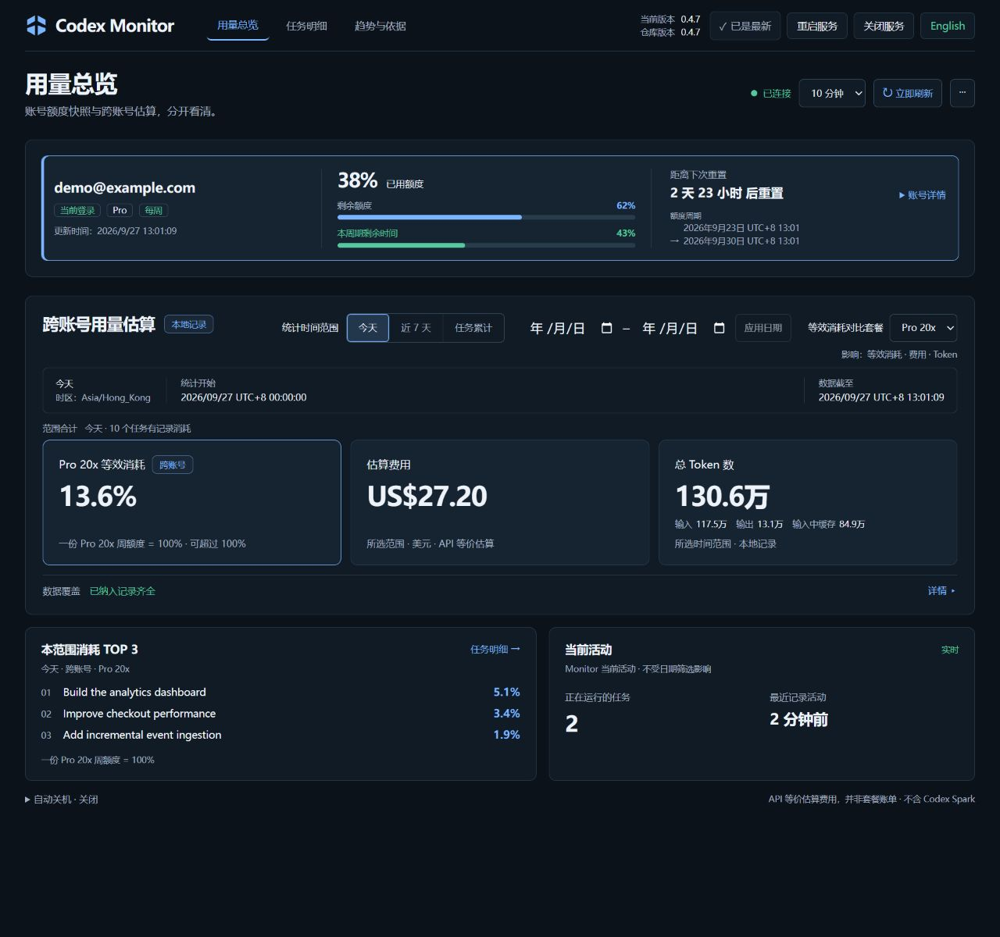
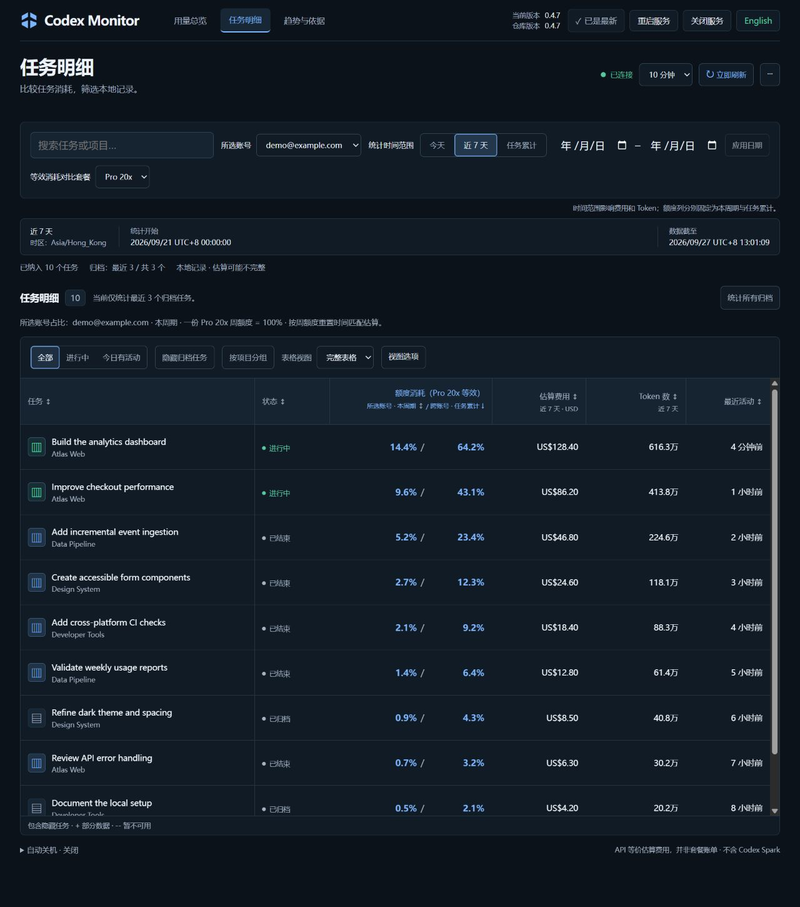
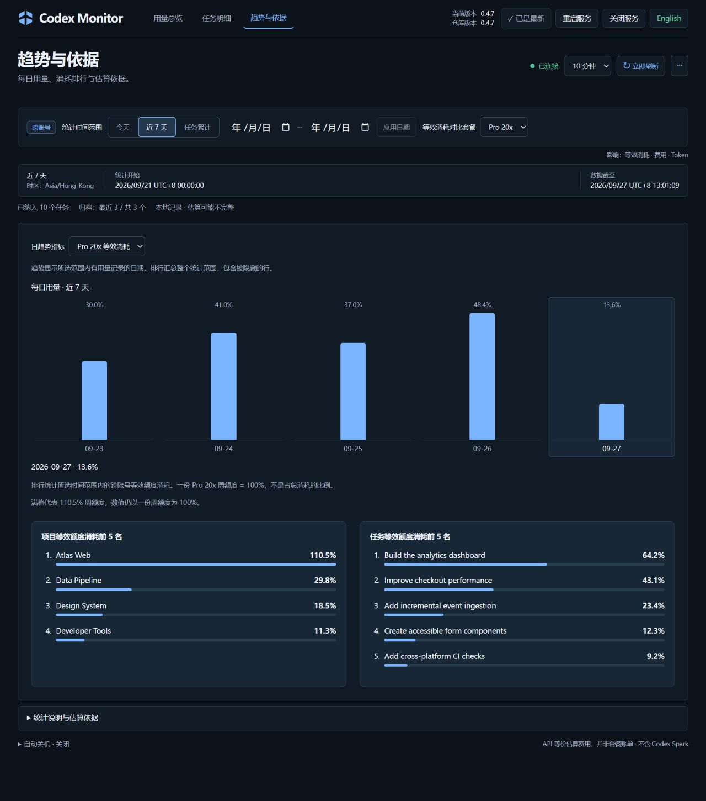

# Codex Monitor

**看清 Codex 用量花在哪里：按任务、项目和时间范围分析。**

简体中文 | [English](README.en.md)

本地 Codex 用量仪表盘，基于 [manuelsh/codex-monitor](https://github.com/manuelsh/codex-monitor) 改进易用性与统计展示。非 OpenAI 官方产品，也不是计费系统。

**[v0.4.10](https://github.com/tabztggg/codex-monitor/releases/tag/v0.4.10)** · 一键安装自动准备 Node.js/npm、Git、PowerShell 7 和 Codex CLI。[更新日志](CHANGELOG.md)



v0.4.7 实际界面截图，账号、任务和用量均为虚构演示数据。

<details>
<summary>任务明细与趋势页面</summary>





</details>

## 三个页面

- **用量总览 `/`**：当前登录账号的额度、完整周期和更新时间，双进度条对比剩余额度与剩余时间；所选范围的跨账号估算、费用、Token 拆分、消耗前 3 名与当前活动。
- **任务明细 `/tasks`**：搜索、筛选、排序、列设置和项目合计。可查看历史账号记录，**不会切换 Codex 登录**。展开任务可查询官方累计额度及模型、推理强度、速度分布。
- **趋势与依据 `/trends`**：每日费用／Token、所选范围的跨账号额度排行，以及数据覆盖和估算依据。

默认读取未归档任务和最近 30 个归档主任务，包含可归属的子任务；选择“统计所有归档”才扩大读取。任务统计默认每 10 分钟刷新，可选 30 秒、1／2／5／10／30／60 分钟，也可立即刷新。旧版高频设置首次升级为 10 分钟，之后记住你的选择。页面隐藏时暂停新的统计请求，返回后按需补刷，断线保留旧值。账号额度每 5 分钟更新、活动检测每 1 分钟；启用自动关机时活动检测恢复为 2 秒。中英文可切换并记住选择，新访问者默认英语。

## 快速开始

Windows 一键安装会检查并自动准备 **Node.js/npm、Git、PowerShell 7 和 Codex CLI**，优先复用已有可用版本。使用前需自行登录 Codex。其他平台手动安装需要 Node.js 22.13+（推荐）、npm 和支持 `codex app-server` 的 Codex；基础运行最低 Node.js 20。

没装 Git 也可以直接[下载源码 ZIP](https://github.com/tabztggg/codex-monitor/archive/refs/heads/main.zip)，解压后双击 **Install Codex Monitor.vbs**。已有 Git 可用以下命令获取源码：

```bash
git clone https://github.com/tabztggg/codex-monitor.git
cd codex-monitor
```

**Windows：** 根目录提供四个无命令行窗口的入口：

| 入口 | 用途 |
| --- | --- |
| **Install Codex Monitor.vbs** | 安装／修复当前源码版本，创建桌面快捷方式和登录自启动，完成后打开网页。 |
| **Codex Monitor.vbs** | 日常启动；未安装时自动安装。 |
| **Update Codex Monitor.vbs** | 将已安装副本更新到仓库最新版。 |
| **Uninstall Codex Monitor.vbs** | 停止并移除应用、自启动和所属快捷方式；保留配置、用量缓存、日志和备份。 |

首次安装需联网：缺失的运行工具下载到 `%LOCALAPPDATA%\Programs\CodexMonitorTools`（Node.js 24 LTS、Git 官方 MinGit、PowerShell 7；缺少 Codex CLI 时安装官方 npm 包），随后安装项目依赖并构建。无需管理员权限，不修改系统 PATH 或账号登录。下载包校验 SHA256，失败会停止并保留原工具；日志在源码 `.cache/desktop-entry.log` 和 `.cache/bootstrap.log`。卸载保留配置、用量数据和工具目录，重装可复用；不删除源码仓库。

**一键更新：** 双击根目录 **Update Codex Monitor.vbs**，自动启动 Monitor 并更新已安装副本到本仓库 `main` 最新版，打开网页查看进度，全程无命令行窗口。未安装时先自动部署；已有更新进行时直接查看进度。源码目录不会被覆盖。

要将当前本地源码重新部署到已安装副本：

```powershell
wscript.exe "Codex Monitor.vbs" deploy
```

Monitor 独立于 Codex 运行。网页右上角显示当前版本和仓库版本；状态与更新合为一个按钮：「已是最新」可重新检查，「更新至…」高亮提示，有检查故障时可重试。自动检查缓存 30 分钟，手动检查最短间隔 5 分钟，单次仓库请求超时为 10 秒。更新安装本仓库 `main` 最新提交（需要 Git、npm 和 PowerShell 7）：下载、构建时继续运行，准备好后自动停止、替换并重启；保留配置和用量缓存，安装或健康检查失败会回滚。旁边可重启或关闭 Monitor；关闭后需用桌面快捷方式再次启动。[Windows 部署说明](docs/standalone-windows.md)

**macOS／Linux，或手动运行：**

```bash
npm ci
npm run build
CODEX_MONITOR_HOST=127.0.0.1 CODEX_MONITOR_DRY_RUN=1 npm start
```

PowerShell 7 手动运行时，先设置 `$env:CODEX_MONITOR_HOST = '127.0.0.1'` 和 `$env:CODEX_MONITOR_DRY_RUN = '1'`，再执行 `npm start`。

打开 **[http://127.0.0.1:4201](http://127.0.0.1:4201)**；手动运行需保持终端，`Ctrl+C` 停止。上述手动命令模拟关机，不执行真实关机。无需单独提供 API Key；找不到 Codex 时设置 `CODEX_MONITOR_CODEX_PATH`。

## 统计口径

| 显示内容 | 统计范围 |
| --- | --- |
| 首页账号额度 | Monitor 的 Codex CLI 当前登录账号，可能与桌面应用登录账号不同。历史快照会标注时间。 |
| 任务额度左侧 | **所选账号 · 本周期**；历史账号使用最后记录的周期。 |
| 任务额度右侧 | **跨账号 · 任务累计**，含本地保留的所有周期与已归属子任务。 |
| 汇总、费用、Token、趋势与排行 | **所选时间范围内的跨账号记录**：今天、近 7 天、任务累计或自定义日期；按 Monitor 时区，含结束日。 |

时间范围不会改变任务额度列的两种固定口径；搜索、隐藏归档等显示筛选不会改变范围合计。任务列的左右箭头分别按两侧数值排序，项目行按任务合计。

**等效消耗以一份所选套餐周额度为 100%，不是总消耗中的占比，可超过 100%。** 估算假定记录中的 Pro 均为 20x，日志不能可靠区分 5x／20x；Pro 20x、Pro 5x、Plus 仅按 1、4、20 倍对比，不修改账号档位。账号徽标只显示接口返回的套餐。

账号归属按周重置时间匹配（允许 60 秒误差），不是可靠账号 ID；相同重置时间无法区分。费用是按 Token 价格折算的 API 等价美元，包含已定价的 GPT-6 Astra／Sol／Luna，并非订阅账单。缺失日志、其他设备使用和未定价模型会影响结果；`--` 表示不可用，`+` 表示部分数据。

校准使用近期有效额度变化；样本不足沿用已有值，后台更新。页面会标明自动、历史或手动基准。官方任务明细独立查询、按账号缓存 5 分钟，失败保留同账号旧值；接口可能变更或延迟，不覆盖本地校准。[完整统计说明](docs/setup-and-reference.md#metric-details)

## 本地数据与远程访问

默认只监听本机，读取 Codex 日志和元数据，缓存写入 `.cache/`，不改写原始会话。官方额度查询使用本机 Codex 登录并可能联网；任务详情可能包含提示词、命令和路径。

**没有内置登录认证或 TLS。任何能访问网页的人都能读取数据，并在托管启动器启用时更新／重启／关闭 Monitor。** 公网访问需自行配置访问控制；Origin 检查不是身份认证。cpolar／反向代理还需设置 `CODEX_MONITOR_ALLOWED_ORIGINS`，Windows 独立安装使用 `standalone.json` 的 `allowedOrigins`。[隧道配置](docs/standalone-windows.md#reverse-proxy-or-tunnel)

## 文档与开发

[完整使用文档](docs/setup-and-reference.md) · [Windows 部署](docs/standalone-windows.md) · [更新日志](CHANGELOG.md)

技术栈：TypeScript、React、Vite、Express、WebSocket。开发：`npm run dev`；检查：`npm test`、`npx tsc --noEmit`、`npm run build`。

独立 UI 预览：`npx vite --config web/vite.preview.config.ts`，默认 4202；`CODEX_MONITOR_PREVIEW_API` 可指定后端，不替换已部署服务。

## 致谢与许可

原项目由 [manuelsh](https://github.com/manuelsh/codex-monitor) 创建，本版本主要改进易用性和用量分析。仓库目前没有 `LICENSE` 文件，不声明 MIT／Apache 许可；使用和分发前请核对适用的上游许可。
